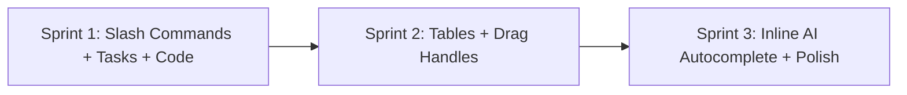

# CoWrite: Next-Generation Editor & Platform Roadmap 🚀

This document outlines the strategic roadmap to transform **CoWrite** from a traditional Google Docs-style editor into a sleek, ultra-modern collaborative workspace (combining the best of **Notion, Linear, and Google Docs**) while preserving the bulletproof **TipTap (ProseMirror) + Yjs** foundation.

---

## 🎯 Executive Vision
- **Retain Rock-Solid Stability**: Keep the robust ProseMirror + Yjs CRDT real-time collaboration engine.
- **Achieve Modern UX ("Plate/Notion Feel")**: Replace static document mechanics with fluid slash commands, block handles, inline tools, and rich interactive blocks.
- **Differentiate with AI**: Deepen Groq AI capabilities with inline ghostwriting, autocomplete, and contextual block transformations.

---

## 🗺️ Feature Phases & Implementation Plan

### Phase 1: Modern Interaction & Navigation (The "Notion / Linear Feel")
Transform the way users interact with text on the page:

1. **Notion-Style Slash Commands (`/`)**:
   - Typing `/` anywhere on an empty line or in text brings up a floating command palette.
   - Quick search & insert: Headings, Bullet Lists, Numbered Lists, Task Lists, Blockquotes, Tables, Code Blocks, Divider, and AI Commands.
   - Built using TipTap's `@tiptap/suggestion` extension (the exact technology powering Linear and Notion clones).

2. **Floating Block Actions (Hover Drag Handles `⋮⋮` & Plus `+`)**:
   - Hovering over any paragraph, heading, or block reveals a subtle left-gutter control:
     - `+` Button: Inserts a new block below.
     - `⋮⋮` Handle: Drag to reorder blocks or click to open block action menu (Delete, Turn into, Copy Link).

3. **Contextual Floating Bubble Menu Polish**:
   - Sleeker, rounded-full pill floating toolbar on text selection with quick formatting: Bold, Italic, Link, Code, Inline AI, and Color.

---

### Phase 2: Rich Media & Advanced Content Blocks
Expand content types beyond plain text:

1. **Interactive Task Lists (Checklists)**:
   - Checkbox items with custom styling (`@tiptap/extension-task-list` & `@tiptap/extension-task-item`).
   - Checking items creates smooth strikethrough animations and syncs in real-time across collaborators.

2. **Full Table Support**:
   - Insert and edit tables (`@tiptap/extension-table`, `@tiptap/extension-table-row`, `@tiptap/extension-table-cell`, `@tiptap/extension-table-header`).
   - Interactive table controls: Add/remove rows & columns, resize columns, header rows.

3. **Syntax-Highlighted Code Blocks**:
   - Integrated with `lowlight` / `highlight.js`.
   - Language selector dropdown (JavaScript, Python, HTML, CSS, JSON, etc.) and one-click copy button.

4. **Callout / Admonition Blocks**:
   - Visual callout cards (Note, Warning, Tip, Idea) with emoji or custom icons and soft tinted backgrounds.

5. **Image Upload & Resizing**:
   - Drag & drop or paste images directly into the editor with interactive resize handles and captions.

---

### Phase 3: Next-Gen AI Writer Capabilities (Powered by Groq)
Move beyond modal-driven AI into seamless inline workflows:

1. **Inline AI Ghostwriting ("Ask AI to continue writing" / `Tab` to accept)**:
   - Pressing `Space` on an empty line or typing `+++` triggers inline AI generation that streams suggestions directly onto the page.

2. **Contextual Selection Transformations**:
   - Highlight any text and select:
     - "Make shorter" / "Expand"
     - "Translate to..." (Spanish, French, German, Hindi, etc.)
     - "Simplify language"

3. **Doc Chat Panel**:
   - Dedicated collapsible right-side drawer to chat with the entire document (already partially built via `ask_document`), with citations and suggestions.

---

### Phase 4: Collaboration & Workspace Polish
Take team workflows to the next level:

1. **Version History & Document Snapshots**:
   - View previous saved versions with timestamped revisions and one-click restore.

2. **Word Count, Reading Time & Document Stats**:
   - Clean, non-intrusive status bar in the bottom corner showing word count, character count, and estimated reading time (`@tiptap/extension-character-count`).

3. **Workspace Dark Mode**:
   - Seamless dark/light theme switch with tailored contrast for late-night writing sessions.

4. **Collaborator Presence Avatars & Active Follow**:
   - Click a collaborator's avatar in the top bar to teleport and follow their viewport as they scroll and type.

---

## 📊 Priority Matrix & Effort Breakdown

| Feature | Impact | Effort | Recommendation |
|---|---|---|---|
| **Slash Command Menu (`/`)** | 🔥 Very High | Medium | **Top Priority (Sprint 1)** |
| **Interactive Task / Checklists** | High | Low | **Quick Win (Sprint 1)** |
| **Code Syntax Highlighting** | High | Low | **Quick Win (Sprint 1)** |
| **Interactive Tables** | High | Medium | **Sprint 2** |
| **Hover Block Drag Handles (`⋮⋮`)**| High | High | **Sprint 2** |
| **Inline AI Autocomplete / Stream**| 🔥 Very High | Medium | **Sprint 3** |
| **Dark Mode & Document Stats** | Medium | Low | **Sprint 3** |

---

## 🛠️ Step-by-Step Implementation Sequence

